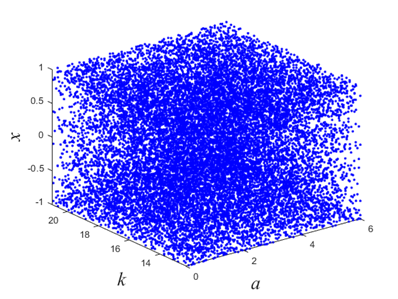
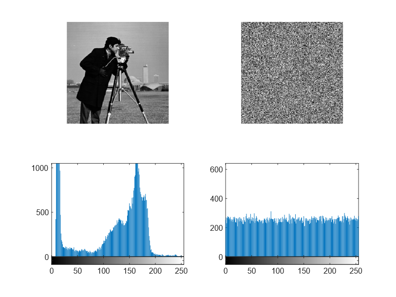
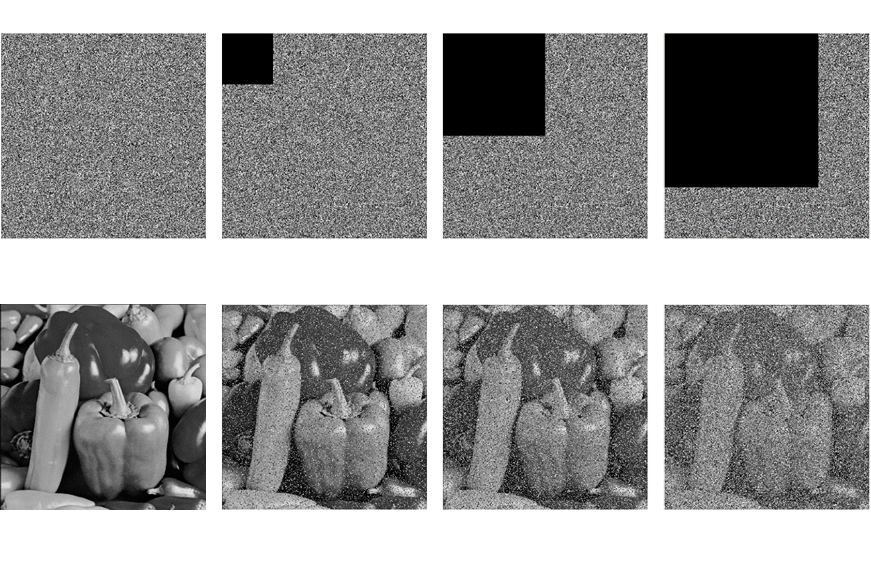
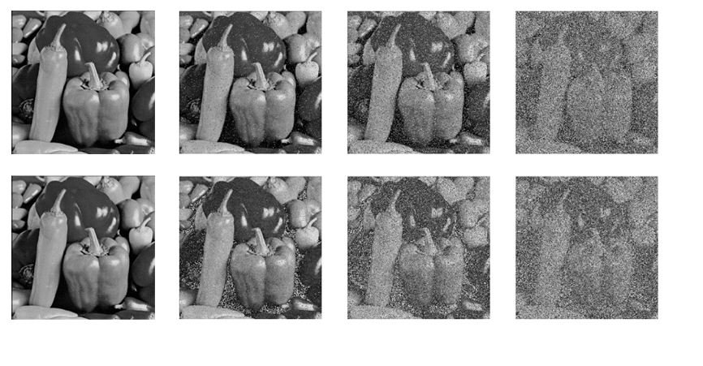
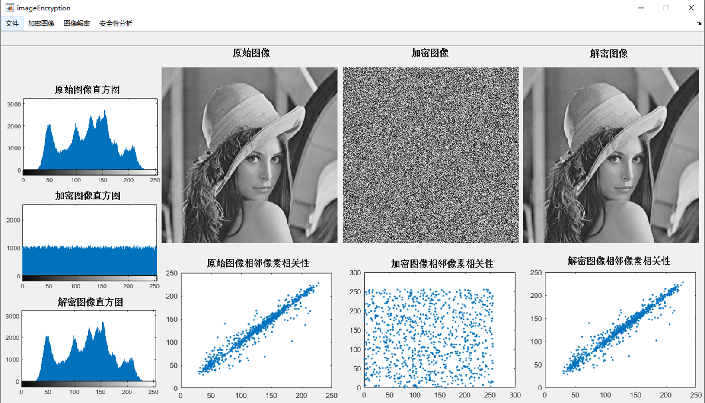

# Chaotic-image-encryption-algorithm

In this paper, we introduce a new Sine-Henon map (ICSM), which is a cascade of Sine map and Henon map. Combining the two-dimensional ICSM and CMT, a novel image encryption algorithm is also further elaborated.

## ICSM map

## Encryption Performance

### Histogram

### NPCR and UACI test

| Figure        | NPCR(%) | UACI(%) |
| ------------- | ------- | ------- |
| Cameraman.tif | 99.6277 | 33.4585 |
| Lena.tif      | 99.6281 | 33.4783 |
| Baboon.tif    | 99.5964 | 33.4800 |
| Peppers.tif   | 99.5911 | 33.4765 |
| Goldhill.tif  | 99.5903 | 33.4591 |

### Anti-cutting attack analysis

### Anti-noise attack analysis

### GUI Demo

